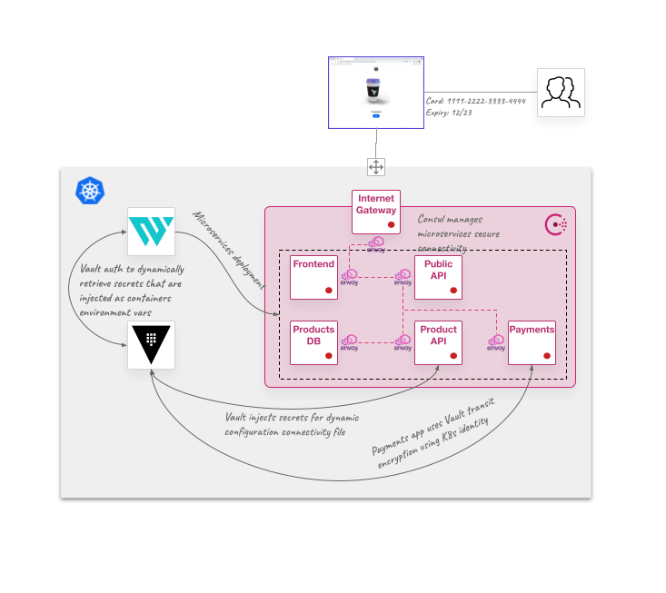

# Zero-Trust demo with HashiCorp stack in Kubernetes

> Disclosure: This is not an official HashiCorp repository and it is intended to be used for learning purposes

This repository is built to show an example of the Zero-Trust concept by using different HashiCorp tools:
* [HashiCorp Vault](https://www.vaultproject.io/) to centraly handle secrets management and encryption with an identity based authentication
* [HashiCorp Consul](https://www.consul.io/) to secure service-to-service connectivity using [Consul Service Mesh](https://www.consul.io/use-cases/zero-trust-networking)
* [HashiCorp Waypoint](https://www.waypointproject.io/) to deploy the application services and dynamically manage configuration injection

Here is an image of the deployment environment:



## Zero-Trust context

We mean by Zero-Trust to follow three principles:

* Least privilege. Everything should be managed by the least privilege principle, so anyone should have access to only the specific needed resources
* Trust nothing. Every access/action should be always authenticated and authorized
* Assume the breach. Defend and prevent assuming that your environment is going to be compromised at some point


Some important configurations in this learning repo are related with the Zero-Trust concept:
* [Vault Kubernetes authentication](https://learn.hashicorp.com/tutorials/vault/agent-kubernetes) to inject authentication and secrets access to some Kubernetes deployed pods, and also to encrypt data in transit from the application, enforced by policies defined in Vault
* [Consul Template](https://github.com/hashicorp/consul-template) is used as sidecar containers to configure dynamically some services with connectivity configurations from Consul and secrets access from Vault
* [Dynamic deployment environment configurations](https://www.waypointproject.io/docs/app-config/dynamic) from Vault secrets by injecting at deployment time environment variables configurations
* [Consul Connect Service Mesh](https://www.consul.io/docs/k8s/connect) configuration to enforce security mTLS connections in our East-West traffic
* [Consul CRDs](https://www.consul.io/docs/k8s/crds) to enforce Kubernetes service mesh secure connectivity like intentions and ingress traffic


## How to build your Zero-Trust Kubernetes environment

You are going to deploy the whole environment by doing different things:
* Create or get access to a Kubernetes cluster. *This repo was created by testing with Minikube and GKE clusters*
* Deploy Vault with Helm. *We are providing a [`values.yaml`](hashicorp_values/vault-values-persistent.yaml) file to deploy a simple 1-node cluster with file persistent storage (without HA)*
* Deploy Consul with Helm. *We are providing a [`values.yaml`](hashicorp_values/consul-values.yaml) file to deploy a simple 1-node cluster with ACLs enabled*
* Install Waypoint with Helm. *[Here](hashicorp_values/waypoint-values.yaml) is the `values.yaml` which deploys Waypoint server and runner*
* Create a namespace `apps` to deploy your applications


Then you will be able to test the Zero-Trust application environment by:
* Configuring Vault policies, authentication methods and create all the required secrets
* Configuring Waypoint initial login and server to manage dynamic configuration with Vault
* Deploying your applications with Waypoint:
  * If you have Docker Registry credentials to push to a container registry you can use [this Waypoint config](Project/applications/waypoint.hcl)
  * If you just want to work with default application images you can use [this other Waypoint config](Project/applications/waypoint.hcl)
* Configuring Consul intentions and service defaults to access your example application

I have included [some scripts](scripts) to make the process easier, which is [explained below](#quickly-deploy-everything)


## Requirements

You will need some pieces to work with this repo

* A MacOS or Linux terminal
* [Minikube](https://minikube.sigs.k8s.io/docs/start/) or GCP access to create the K8s cluster (*you should be able to work with any other Kubernetes environmet, but I didn't test it*)
* [kubectl](https://kubernetes.io/docs/tasks/tools/#kubectl) CLI tool
* [Docker](https://docs.docker.com/get-docker/) local installation
* [Waypoint binary](https://www.waypointproject.io/downloads)


## Quickly deploy everything

If you want to deploy everything in just a couple of minutes here are the steps using the scripts (Minikube example, but with GKE would be similar):

* If you want to deploy locally create a Minikube cluster:
  ```bash
  minikube start -p hashikube --cpus='4' --memory='8g'
  ````

> Note: Instead of using Minikube - if you have a GCP account with GKE admin permissions - you can do the following to create a GKE cluster from your terminal [install gcloud SDK first](https://cloud.google.com/sdk/docs/install):
>  ```bash
>  gcloud auth login
>
>  gcloud container clusters create hashikube \
>  -m n2-standard-2 \
>  --num-nodes 3 \
>  --zone europe-west1-c \
>  --release-channel rapid
>
>  gcloud container clusters get-credentials hashikube --zone europe-west1-c
>  ```

* Open a new terminal and execute the `minikube tunnel` to expose the `LoadBalancer` services (you don't need to do this if running in a GKE environment or using MetalLB or similar in your one node cluster):
  ```bash
  minikube tunnel -p hashikube -c
  ```

> Note: If you don't like `minikube tunnel` you can use MetalLB addon from Minikube:
>  ```bash
>  minikube addons enable metallb -p hashikube
> 
>  minikube ip # Take note of the IP address to configure your LBs range
> 
>  minikube addons configure metallb -p hashikube
>   -- Enter Load Balancer Start IP: < Next IP address from you Minikube IP>
>   -- Enter Load Balancer End IP: < Last IP address you want for your LBs address >
> 
>  ```

* Deploy Vault, Consul and Waypoint with the following command in the first open terminal (or a terminal where your `minikube tunnel` is not running):
  ```bash
  make install
  ```

* Configure Vault:
  ```bash
  make vault
  ````

* Configure Waypoint:
  ```bash
  make waypoint
  ```

> NOTE: Wait for Waypoint to complete deployment
> Sometimes Waypoint can take some time to deploy the Waypoint Runner. You can check by:
> ```
> kubectl get po -n waypoint
> NAME                          READY   STATUS      RESTARTS   AGE
> waypoint-bootstrap--1-588ck   0/1     Completed   0          2m45s
> waypoint-runner-0             1/1     Running     0          3m5s
> waypoint-server-0             1/1     Running     0          3m5s
> ```

* Deploy Consul CRDs:
  ```bash
  make consul
  ```

## Deploy Hashicups Application

Use the main Waypoint configuration at `Project > waypoint.hcl` to deploy the application. It just deploys by pulling already built images in `ghcr.io/dcanadillas`. You just need to do the following to deploy:
  
```bash
cd Project
waypoint init
waypoint up
```

> NOTE: The images are built for x86 architecture. If you are running an ARM based machine like an Apple M1, you should need to build the whole project building and doing a push to your container registry. This can be done in the other Waypoint configuration located at `Project/applications/waypoint.hcl`
> In this case you will need to specify your Waypoint input variables:
> ```
> waypoint up -var registry=<your_docker_registry> -var platform=linux/arm64
> ```

The background process of previous commands is:
* It pulls the required microservices of the application from ``ghcr.io/dcanadillas/hashicups/*` using the [Waypoint Docker Plugin](https://www.waypointproject.io/plugins/docker#docker-pull-builder)
* It deploys the different services as Helm releases by the usage of the [Waypoing Helm plugin](https://www.waypointproject.io/plugins/helm#helm)

Now you can access to your application in your web browser by connecting to the Consul Ingress Gateway. It is running as a `LoadBalancer` service, so you can get the URL by:

```bash
echo "http://$(kubectl get svc -n consul consul-ingress-gateway -o jsonpath={.status.loadBalancer.ingress[].ip}):8080"
```

## Accesing our applications configurations with Waypoint

Because we are using the [Waypoint Entrypoint](https://www.waypointproject.io/docs/entrypoint) we are injecting some of the configurations in our application pods. 

You can check Waypoint configuration to connect to Vault:

```
$ waypoint config source-get -type vault
           KEY           |          VALUE           
-------------------------+--------------------------
  kubernetes_role        | waypoint                 
  skip_verify            | true                     
  namespace              | root                     
  addr                   | http://vault.vault:8200  
  auth_method            | kubernetes               
  auth_method_mount_path | auth/kubernetes
```

And checking the variables injected in the applications:

```
$ waypoint config get
      SCOPE     |       NAME        |        VALUE        | WORKSPACE | LABELS  
----------------+-------------------+---------------------+-----------+---------
  app: postgres | POSTGRES_PASSWORD | <dynamic via vault> |           |         
  app: postgres | POSTGRES_USER     | <dynamic via vault> |           |         
```

And you can access to the pod value using Waypoint:

```
$ waypoint exec -app postgres printenv POSTGRES_USER
Connected to deployment v1
postgres

$ waypoint exec -app postgres printenv POSTGRES_PASSWORD
Connected to deployment v1
password
```

You can check that these are the values also from Vault:

```
$ kubectl exec -ti vault-0 -n vault -- vault kv get -field data kv/hashicups-db
map[password:password username:postgres]
```


## The Zero-Trust use case

We are considering this example as a `zero-trust` use case because of some exposed configurations:

* `product-api` microservice is using a `ConfigMap` that defines connection string to the `postgres` database microservice. The configuration file data includes a *username*, a *password*  and the connection string with *service* and *port*. These are using [Consul Template](https://github.com/hashicorp/consul-template) sidecar to connect to Vault and Consul to retrieve data (credentials from Vault and service data from Consul). Also, the [Vault Agent injector](https://www.vaultproject.io/docs/platform/k8s/injector) is being used to share Vault token to Consul Template to authentica using Kubernetes service account identity.
* `postgres` microservice is using [Waypoint dynamic config](https://www.waypointproject.io/docs/app-config/dynamic) to inject environment variables with database credentials from Vault. This means that values are securely stored in Vault, and Waypoint is using Kubernetes service account identity to access only to the required secrets, using the least privilege principle which Vault is based on.
* `payments` microservice is encrypting data in transit using [Vault transit engine](https://www.vaultproject.io/docs/secrets/transit), so it can encrypt and decrypt data using  centralized encryption key managed by Vault. The access to Vault is bootstrapped within the microservice application by using Spring connectivity into Vault

## Clean your demo environment

If you want to clean everything just execute the following from the root path of this repo:

```bash
make clean
```


